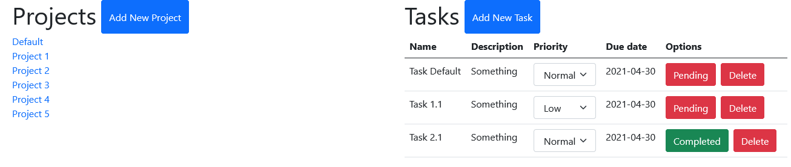

# Todo-List App
> Small app for tracking your activities.



The Users are able to do the following:
 - Create new projects.
 - Create New tasks.
 - View all projects
 - View all tasks in each project.
 - Edit a task.
 - Delete a task.


## Built With

- Html, CSS, and JavaScript
- Bootstrap

## Live Demo

[Todo List Live Demo](https://adfpizarro.github.io/todo-list/)

## Getting Started


To get a local copy up and running follow these simple example steps.

### Install

You can download the code to your personal computer clonig the repository using the following command

```
git clone

```

### Usage

To run this project you only need to open the index.html file in a web browser

## Authors

👤 **Adrian Flores Pizarro**

- Github: [@AdfPizarro](https://github.com/AdfPizarro)
- Twitter: [@AdfPizarro](https://twitter.com/adfpizarro)
- Linkedin: [adrian-flores-pizarro-73b62316a](https://www.linkedin.com/in/adrian-flores-pizarro-73b62316a/)

👤 **João Paulo Dias França**

- GitHub: [@jpdf00](https://github.com/jpdf00)
- Twitter: [@jpdf00](https://twitter.com/jpdf00)
- LinkedIn: [João Paulo Dias França](https://www.linkedin.com/in/jpdf00/)

## 🤝 Contributing

Contributions, issues, and feature requests are welcome!

Feel free to check the [issues page](https://github.com/AdfPizarro/todo-list/issues).

## Show your support

Give a ⭐️ if you like this project!


## 📝 License

This project is [MIT](./LICENSE) licensed.
